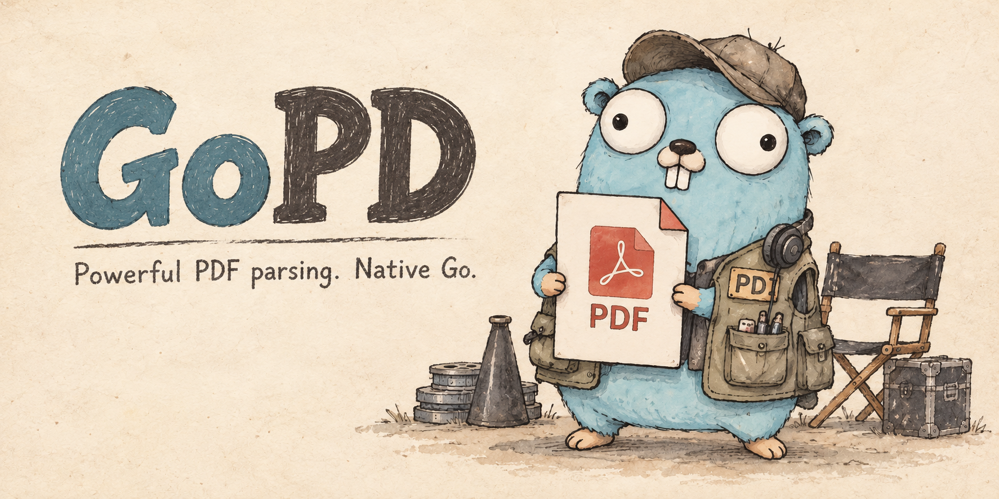

**Go 네이티브로 작성된 파워풀한 PDF 파서**

[English](README.md) | 한국어

## 제작 배경

Go 생태계에서는 MuPDF처럼 강력한 오픈소스 PDF 파서를 찾기 어려웠습니다. 다른 언어로 작성된 DLL을 불러와 사용하는 프로젝트가 많았고, 저는 이런 방식이 아름답지 않다고 생각했습니다.

Go 네이티브로 작성된 프로젝트 중에는 상업적으로 사용되는 프로젝트도 있었습니다. 하지만 저는 그 점이 마음에 들지 않았습니다.

이 프로젝트는 MuPDF를 참고했습니다.

## 지원 기능

GoPD는 PDF에 담긴 콘텐츠와 그 콘텐츠를 구성하는 내부 구조까지 정밀하게 해석하는 것을 목표로 합니다.

- **텍스트** — 문자열뿐 아니라 글자 단위의 문자 코드, Unicode 매핑, 글꼴, 크기, 위치와 변환 정보를 분석합니다.
- **벡터 그래픽** — 선과 베지어 곡선으로 구성된 경로, 윤곽선과 채우기, 색상, 선 두께, 점선과 클리핑 정보를 분석합니다.
- **이미지** — 이미지의 원본 스트림, 해상도, 색 공간, 마스크 여부와 페이지에 배치되는 위치·크기·회전을 분석합니다.
- **콘텐츠 실행 구조** — 텍스트·그래픽·이미지의 그리기 순서와 상태 변화, 중첩된 Form XObject의 호출 관계를 추적합니다.
- **파일 내부 구조** — PDF 객체와 간접 참조, 압축된 객체 스트림, xref 테이블·스트림과 증분 갱신 연결 구조를 분석합니다.
- **원본과의 연결** — 해석 결과에서 해당 요소를 만든 명령과 객체, 원본 또는 디코딩된 데이터의 바이트 범위까지 추적할 수 있도록 합니다.

현재는 이 목표의 일부를 구현한 단계이며, 복잡한 색 공간·투명도 효과, 인라인 이미지, 암호화된 콘텐츠 등의 해석에는 제한이 있습니다.
