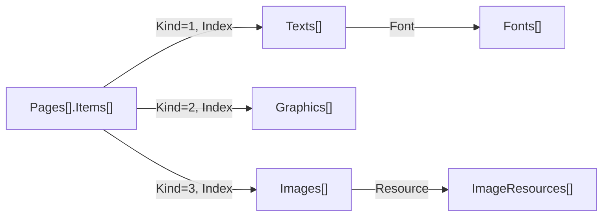

# PDF 파싱 결과 JSON 구조

이 문서는 로컬에 저장한 `테스트PDF.parsed.json`의 키 구조와 참조 관계를 설명합니다. 대상 스키마는 `gopd-parsed-v1`이며 이 출력 파일과 원본 PDF는 Git에 포함하지 않습니다.

이 파일은 콘텐츠 정보와 정밀 분석 정보를 함께 담은 기존 상세 결과입니다. 현재 `gopd.ParsePDF()`의 기본 객체와 기본 JSON은 [기본 PDF API](basic-pdf.md)에서 설명합니다. 기존 상세 JSON 파일은 변경하지 않았습니다. 현재 CLI의 `-json` 옵션은 개수 요약만 출력하므로 두 객체의 전체 JSON과는 출력 범위가 다릅니다. 콘텐츠 종류나 페이지를 선택해 파싱하는 모드는 아직 제공하지 않습니다.

본문의 `[]`는 배열을 뜻합니다. 예시는 구조 설명용이며 실제 문서 내용이나 좌표를 재현한 것이 아닙니다.

## 1. 전체 구조

```text
루트
├─ SchemaVersion
├─ Input
├─ Summary
├─ Pages[]
├─ Texts[]
├─ Graphics[]
├─ Images[]
├─ ImageResources[]
├─ Fonts[]
├─ Annotations[]
├─ Structure
├─ Sources[]
├─ Diagnostics[]
├─ ReadOptions
└─ Serialization
```

| 키 | JSON 형태 | 역할 |
| --- | --- | --- |
| `SchemaVersion` | 문자열 | JSON 저장 형식의 버전. 현재 값은 `gopd-parsed-v1` |
| `Input` | 객체 | 입력 파일명, 바이트 크기, SHA256 |
| `Summary` | 객체 | 페이지와 콘텐츠 등의 개수 |
| `Pages` | 배열 | 페이지 속성과 콘텐츠 참조 |
| `Texts` | 배열 | 문서 전체의 텍스트 표시 구간 |
| `Graphics` | 배열 | 문서 전체의 벡터 경로 그리기 결과 |
| `Images` | 배열 | 이미지가 페이지에 배치된 발생 목록 |
| `ImageResources` | 배열 | 이미지 크기·색 공간·스트림 등 공유 정보 |
| `Fonts` | 배열 | 글꼴과 문자 해석 정보 |
| `Annotations` | 배열 | 주석·링크 등의 객체 정보 |
| `Structure` | 객체 | 헤더, xref, PDF 객체 등 저수준 구조 |
| `Sources` | 배열 | 원본 파일과 디코딩된 데이터의 출처 설명 |
| `Diagnostics` | 배열 | 콘텐츠 해석 중 수집한 진단 |
| `ReadOptions` | 객체 | 파싱에 사용한 제한 설정 |
| `Serialization` | 객체 | 바이트·숫자·열거형 등의 JSON 표현 규칙 |

현재 Go의 `DetailedPDF`가 이 파일의 상세 콘텐츠 모델에 해당합니다. 실행 중 사용하는 `Document`는 JSON에서 제외했고, `Input`, `Summary`, `Sources`, `Serialization` 등의 설명 정보를 추가했습니다. 현재 기본 `PDF`는 페이지별 이중 배열 `Texts`와 `Graphics`만 공개하는 별도 타입입니다.

## 2. 배열 사이의 참조 관계

콘텐츠는 페이지마다 중복 저장하지 않고 최상위 배열에 모읍니다. `Pages[].Items[]`가 콘텐츠 종류와 배열 인덱스로 연결합니다.



| 참조 필드 | 연결 대상 |
| --- | --- |
| `Pages[].Items[].Index` | `Kind`에 해당하는 최상위 콘텐츠 배열 |
| `Texts[].Font` | 최상위 `Fonts` 배열. 글꼴을 선택하지 않은 상태는 `-1` |
| `Images[].Resource` | 최상위 `ImageResources` 배열 |
| `Pages[].Annotations[]` | 최상위 `Annotations` 배열 |
| 콘텐츠의 `Source.Page` | 최상위 `Pages` 배열 |
| 콘텐츠의 `Source.Operations[]` | 해당 페이지의 `Operations` 배열 |
| `Span.Source` 또는 `Position.Source` | `Sources`에서 `ID`가 같은 항목 |

배열 인덱스는 모두 **0부터 시작**합니다. 반면 `Source` ID와 PDF 객체 번호는 식별자이며 배열 인덱스로 사용하면 안 됩니다.

예를 들어 `Pages[0].Items`가 다음과 같다면 첫 번째 페이지에는 텍스트, 그래픽, 텍스트 순서로 그리기 작업이 수행됩니다.

```json
[
  { "Kind": 1, "Index": 0 },
  { "Kind": 2, "Index": 0 },
  { "Kind": 1, "Index": 1 }
]
```

이는 `Texts[0]`, `Graphics[0]`, `Texts[1]`을 가리킵니다. 이 순서는 PDF의 **그리기 순서**이며, 사람이 읽는 문장·문단 순서를 의미하지 않습니다.

## 3. 페이지: `Pages[]`

| 키 | 의미 |
| --- | --- |
| `Index` | 페이지 인덱스 |
| `Object` | 페이지를 나타내는 PDF 객체 |
| `MediaBox` | 페이지 전체 영역 |
| `CropBox` | 페이지 표시·잘라내기 영역 |
| `Rotate` | 페이지 회전값. 콘텐츠 좌표에 별도로 적용해야 함 |
| `UserUnit` | PDF 사용자 좌표 단위의 배율 |
| `Resources` | 글꼴·이미지·그래픽 상태 등 페이지 리소스 사전 |
| `Contents` | 페이지 내용 스트림에 해당하는 PDF 객체 목록 |
| `Items` | 콘텐츠 종류와 인덱스를 그리기 순서로 나열한 목록 |
| `Operations` | 페이지와 호출된 Form에서 읽은 명령 목록 |
| `Annotations` | 최상위 주석 배열을 참조하는 인덱스 목록 |
| `Complete` | 현재 해석기가 페이지 처리 중 미지원 효과 등의 진단 없이 처리했는지 여부 |

`Items` 항목은 `Kind`와 `Index`로 구성됩니다. `Kind`는 `1=Text`, `2=Graphic`, `3=Image`입니다.

`Complete: true`는 픽셀 렌더링, OCR, 글리프 윤곽선까지 구현되었다는 보증이 아닙니다. `false`이면 `Diagnostics`에서 해석 한계를 확인합니다.

### 명령: `Pages[].Operations[]`

| 키 | 의미 |
| --- | --- |
| `Operator` | 명령 이름. 예: `Tj`, `TJ`, `m`, `l`, `S`, `Do` |
| `Operands` | 명령에 전달된 인수 목록. 각 인수는 PDF 객체 구조 |
| `Span` | 연산자 토큰 자체의 바이트 범위. 인수는 각자의 `Span`을 가짐 |
| `FormPath` | 해당 명령까지 도달한 Form 호출 경로 |

명령 배열에는 상태 변경 등 콘텐츠 요소를 직접 만들지 않는 명령도 포함됩니다. 따라서 `Operations` 개수와 `Items` 개수는 다릅니다.

## 4. 텍스트: `Texts[]`

한 항목은 텍스트를 표시한 구간입니다. 항목 하나가 단어 하나 또는 문단 하나와 일치하지는 않습니다.

| 키 | 의미 |
| --- | --- |
| `Unicode` | 문자 코드에서 해석한 문자열 |
| `RawCodes` | PDF에 저장된 문자 코드 바이트. JSON에서는 Base64 문자열 |
| `Font` | 최상위 `Fonts` 배열의 인덱스 |
| `FontSize` | 텍스트 명령의 글꼴 크기. 최종 크기에는 변환 행렬도 영향을 줌 |
| `Matrix` | 표시 작업 시작 시점의 페이지 공간 텍스트 행렬. 글꼴 크기 배율 적용 전 값 |
| `RenderingMode` | 채우기·윤곽선·클리핑 등 PDF 텍스트 표시 방식의 숫자 코드 |
| `Glyphs` | 문자 코드별 글리프 위치와 해석 정보 |
| `DecodeComplete` | 구간의 문자 코드를 모두 지원되는 방식으로 해석했는지 여부 |
| `PositionComplete` | 구간의 위치·이동량 계산을 지원하는지 여부 |
| `Source` | 페이지·명령·바이트 출처 |
| `State` | 해당 텍스트를 그릴 때의 그래픽 상태 |

### 글리프: `Texts[].Glyphs[]`

| 키 | 의미 |
| --- | --- |
| `Code` | 원본 문자 코드 바이트의 Base64 표현 |
| `Unicode` | 해당 코드에서 해석한 문자열 |
| `Origin` | 페이지 공간의 글리프 시작점 |
| `Advance` | 다음 위치로 이동하는 벡터 |
| `DecodeComplete` | 해당 코드의 문자 해석이 완료되었는지 여부 |
| `WidthKnown` | 위치 계산에 사용하는 글리프 폭을 알고 있는지 여부 |

하나의 문자 코드가 여러 Unicode 문자에 대응할 수 있으므로 `Glyphs` 개수와 문자열 길이를 동일하게 취급하지 않습니다. `Origin`과 `Advance`는 글리프의 외곽 경계 상자가 아닙니다.

## 5. 벡터 그래픽: `Graphics[]`

한 항목은 경로를 그린 발생입니다. 사용자 관점의 도표나 그림 한 개는 여러 항목으로 구성될 수 있습니다.

| 키 | 의미 |
| --- | --- |
| `Segments` | 선·곡선·사각형 등의 경로 구성 목록 |
| `Paint` | 경로에 적용한 그리기 명령 |
| `Stroke` | 윤곽선을 그리는지 여부 |
| `Fill` | 내부를 채우는지 여부 |
| `EvenOdd` | 내부 판정에 홀짝 규칙을 사용하는지 여부 |
| `Source` | 페이지·명령·바이트 출처 |
| `State` | 그릴 때 적용된 그래픽 상태 |

### 경로 조각: `Segments[]`

| 키 | 의미 |
| --- | --- |
| `Operator` | 경로 구성 명령 |
| `Points` | 명령에 해당하는 점·제어점 목록 |
| `Span` | 해당 경로 명령의 바이트 범위 |

`Points`는 경로를 구성할 때 이미 페이지 사용자 좌표계로 변환한 값입니다. 페이지에 배치된 점을 얻으려고 `State.CTM`을 다시 적용하면 변환이 중복됩니다.

## 6. 이미지: `Images[]`와 `ImageResources[]`

`Images`는 배치 정보, `ImageResources`는 공유 이미지 정보입니다. 같은 이미지를 여러 번 사용하면 여러 배치가 하나의 리소스를 참조할 수 있습니다.

### 이미지 배치: `Images[]`

| 키 | 의미 |
| --- | --- |
| `Resource` | 최상위 `ImageResources` 배열의 인덱스 |
| `Matrix` | 이미지 배치 위치·크기·회전 등을 나타내는 변환 행렬 |
| `Source` | 페이지·명령·바이트 출처 |
| `State` | 이미지를 그릴 때의 그래픽 상태 |

### 공유 이미지: `ImageResources[]`

| 키 | 의미 |
| --- | --- |
| `ID` | PDF 객체 번호와 세대 번호 |
| `Object` | 이미지에 해당하는 PDF 객체 |
| `Stream` | 이미지 스트림의 사전과 바이트 위치 |
| `Width`, `Height` | 이미지의 픽셀 크기. 페이지 위의 표시 크기와 구분 |
| `BitsPerComponent` | 색상 성분당 비트 수 |
| `ColorSpace` | 색 공간을 나타내는 PDF 객체 |
| `ImageMask` | 마스크 이미지인지 여부 |

현재 JSON에는 이미지 스트림 바이트 본문을 넣지 않았습니다. `Stream.Encoded`는 데이터를 가리키는 범위이며 PNG·JPEG 파일이나 픽셀 배열 자체가 아닙니다.

## 7. 글꼴과 주석

### 글꼴: `Fonts[]`

| 키 | 의미 |
| --- | --- |
| `ID`, `Object` | PDF 객체 식별 정보와 글꼴 객체 |
| `Subtype` | 글꼴 종류 |
| `BaseFont` | PDF에 기록된 글꼴 이름 |
| `Encoding` | 문자 코드 해석에 사용하는 PDF 객체 |
| `ToUnicode` | 문자 코드에서 Unicode로 변환하는 CMap. 없거나 확보하지 못하면 `null` |
| `Embedded` | 내장 글꼴 데이터를 나타내는 PDF 객체. 없으면 `null` |
| `DecodeSupported` | 해당 글꼴의 문자 해석 지원 여부 |
| `WidthsKnown` | 글리프 폭 정보 확보 여부 |
| `PositioningSupported` | 해당 글꼴 방식의 위치 계산 지원 여부 |

`ToUnicode`에는 다음 키가 있습니다.

| 키 | 의미 |
| --- | --- |
| `CodeSpaces` | 유효한 문자 코드 범위 목록. 각 항목은 `Low`, `High` |
| `Mappings` | 문자 코드와 Unicode 문자열의 대응표 |
| `MappingKeyEncoding` | 매핑 키의 표현 방식. 현재 `hex` |

`Mappings`의 키는 원본 코드 바이트를 대문자 16진수 문자열로 표현한 것입니다. `CodeSpaces[].Low`와 `High`는 바이트 필드이므로 Base64입니다. 두 표현 방식을 혼동하지 않아야 합니다.

글꼴의 내부 검색 캐시와 폭 조회 테이블 등 비공개 런타임 필드는 별도로 직렬화하지 않았습니다. 저수준 글꼴 객체에 포함된 정보는 `Object`에도 나타날 수 있습니다.

### 주석: `Annotations[]`

| 키 | 의미 |
| --- | --- |
| `Page` | 페이지 인덱스 |
| `Object` | 주석을 나타내는 PDF 객체 |
| `Subtype` | 주석 종류 |
| `Rect` | 주석의 영역 |

현재 테스트 결과는 빈 배열입니다. 위 필드는 Go의 `Annotation` 타입을 기준으로 설명했으며, 주석 외관의 전체 그리기 결과까지 포함하는 구조는 아닙니다.

## 8. 공통 구조

### 콘텐츠 출처: `Source`

`Texts`, `Graphics`, `Images`에서 사용하는 `Source`는 다음과 같습니다. 바이트 범위 내부의 숫자형 `Source`와 구분합니다.

| 키 | 의미 |
| --- | --- |
| `Page` | 콘텐츠가 속한 페이지 인덱스 |
| `Spans` | 해당 콘텐츠를 구성한 명령·인수의 바이트 범위 목록 |
| `Operations` | 해당 페이지의 `Operations` 배열 인덱스 목록 |
| `FormPath` | 중첩된 Form 호출 경로 |

Form은 여러 곳에서 호출할 수 있는 PDF 콘텐츠 묶음입니다. `FormPath[]`의 항목은 `ObjectID`(Form 객체 식별자), `Span`(Form 객체 범위), `Call`(호출 명령 범위)로 구성됩니다. Form 밖의 콘텐츠는 빈 경로를 가집니다.

### 그래픽 상태: `State`

| 키 | 의미 |
| --- | --- |
| `CTM` | 현재 좌표 변환 행렬 |
| `LineWidth` | 선 두께 설정 |
| `LineCap`, `LineJoin` | 선 끝과 연결 부분의 모양을 나타내는 숫자 코드 |
| `MiterLimit` | 뾰족한 연결 부분의 길이 제한 |
| `Dash`, `DashPhase` | 점선 패턴과 패턴 시작 위치 |
| `Stroke`, `Fill` | 윤곽선과 채우기에 사용하는 색상 객체 |
| `StrokeAlpha`, `FillAlpha` | 윤곽선과 채우기의 불투명도 |
| `BlendMode` | 색상 혼합 방식 |
| `Clip` | 누적된 클리핑 경로 목록 |
| `RenderingIntent` | 색상 재현 방식 설정 |
| `Complete` | 미지원 효과를 만났는지 반영한 상태 해석 표시 |

`State.Stroke`와 `State.Fill`은 `Space`(색 공간), `Components`(색상 성분 배열), `Pattern`(패턴 이름)으로 구성됩니다. `Graphic.Stroke`와 `Graphic.Fill`은 불리언이므로 같은 이름이라도 형태가 다릅니다.

`Clip[]`의 각 항목은 `Segments`와 `EvenOdd`로 구성됩니다. 클리핑은 그리기를 허용하는 영역을 제한합니다.

### 좌표와 변환

| 구조 | 형태 |
| --- | --- |
| 점·벡터 | `{ "X": 10, "Y": 20 }` |
| 사각형 | `{ "Min": { "X": 0, "Y": 0 }, "Max": { "X": 100, "Y": 100 } }` |
| 행렬 | `[a, b, c, d, e, f]` 형태의 숫자 6개 |

행렬은 `(x, y)`를 `(a*x + c*y + e, b*x + d*y + f)`로 변환합니다. 현재 콘텐츠 좌표는 페이지 회전을 자동 적용하지 않은 PDF 사용자 좌표계입니다. 화면 좌상단 기준 픽셀 좌표로 사용하려면 페이지의 `Rotate`, `UserUnit`, 표시 배율 등을 고려해야 합니다.

### 바이트 범위: `Span`과 `Position`

```json
{
  "Source": 2,
  "Start": 100,
  "End": 120
}
```

이 `Span`은 **ID가 2인 소스의 100번째 바이트부터 120번째 바이트 직전까지**, 총 20바이트를 뜻합니다. `Position`은 단일 위치를 나타내며 `Source`, `Offset`만 가집니다.

- 오프셋은 문자 수가 아닌 바이트 수입니다.
- `Source: 0`은 위치가 없음을 나타냅니다.
- 디코딩된 소스의 범위를 원본 PDF 파일에 바로 적용하면 안 됩니다.
- 압축 해제 전후의 바이트는 일대일로 대응하지 않습니다. 변환 전 범위는 `Sources[].Origin.Input`으로 추적합니다.

### PDF 객체 식별자: `ObjectID`

`ID` 또는 `ObjectID` 필드에는 `Number`(객체 번호), `Generation`(세대 번호)이 들어갑니다. `{ "Number": 12, "Generation": 0 }`은 PDF의 `12 0` 객체를 식별합니다.

## 9. 저수준 PDF 객체

페이지·글꼴 등의 `Object`, 명령의 `Operands[]`, 사전 값 등에서 공통으로 사용합니다.

```json
{
  "Type": "Integer",
  "Value": "12",
  "Span": { "Source": 1, "Start": 100, "End": 102 }
}
```

| 키 | 의미 |
| --- | --- |
| `Type` | JSON 변환 시 부여한 PDF 값 종류 |
| `Value` | 종류에 따라 형태가 달라지는 실제 값 |
| `Span` | 원본 또는 디코딩 소스에서 해당 값의 범위 |

주요 `Type`과 `Value`의 관계는 다음과 같습니다. `Null`은 표현 규칙에 포함되지만 현재 샘플에는 나타나지 않습니다.

| `Type` | `Value` 형태 |
| --- | --- |
| `absent` | `null`. 선택적 `Object` 값이 설정되지 않음 |
| `Null` | `null`. PDF에 명시적으로 기록된 null |
| `Boolean` | JSON 불리언 |
| `Integer`, `Real` | 원래 십진 표기를 보존한 문자열 |
| `Name` | `/`를 제외하고 이름 escape를 해제한 값. 현재 샘플에서는 문자열 |
| `PDFString` | `Form`과 `Bytes`를 가진 객체 |
| `Array` | `Items`에 PDF 객체 배열을 가진 객체 |
| `Dictionary` | `Entries`에 사전 항목 배열을 가진 객체 |
| `Reference` | `ID`에 참조 대상 `ObjectID`를 가진 객체 |
| `Stream` | 아래의 스트림 구조 |

`PDFString.Form`은 `1=Literal`, `2=Hex`이며, `Bytes`는 구문상의 escape나 hex 표현을 해제한 바이트의 Base64 값입니다. 곧바로 Unicode 문자열로 해석한 결과가 아니므로 읽을 텍스트는 `Texts[].Unicode`를 사용합니다.

`Dictionary.Entries[]`의 키는 `Key`, `KeySpan`, `Value`입니다. 일반 JSON 사전으로 평탄화하지 않고 배열로 저장해 PDF 사전의 항목 순서와 중복 키를 표현할 수 있게 했습니다.

### 스트림: `Stream`

| 키 | 의미 |
| --- | --- |
| `Dictionary` | 스트림 길이·필터 등 속성을 담은 PDF 사전 |
| `DictionarySpan` | 사전의 바이트 범위 |
| `StartKeyword` | `stream` 키워드 범위 |
| `DataStart` | 스트림 데이터 시작 위치. `Source`, `Offset` |
| `Encoded` | 인코딩된 데이터 범위. 경계를 모르면 `null` |
| `EndKeyword` | `endstream` 키워드 범위. 확인하지 못하면 `null` |
| `Boundary` | 경계를 결정한 방식의 숫자 코드 |

`Boundary` 타입에는 `0=Unresolved`, `1=FromLength`, `2=Recovered`가 정의되어 있습니다. 현재 구현은 길이를 기준으로 경계를 확인하며 손상 경계 자동 복구를 제공하지 않습니다. 현재 샘플의 스트림은 `1`입니다.

## 10. 파일 구조: `Structure`

| 키 | 의미 |
| --- | --- |
| `File` | 원본 파일의 Source ID |
| `Header` | 헤더의 `Span`과 `Version` 객체. 버전은 `Major`, `Minor` |
| `Tails` | 파일 끝부분의 `startxref`와 EOF 정보 |
| `XRefs` | 객체 위치를 찾는 xref 섹션 목록 |
| `Objects` | 파싱 과정에서 실제로 로드한 간접 객체 목록 |
| `Regions` | 기록된 파일 영역의 종류와 범위 |
| `Diagnostics` | 저수준 구조 분석 진단 |

`Objects`는 사용하지 않는 객체까지 모두 순회한 결과가 아닙니다. `Regions`도 파일 전체의 모든 바이트를 빠짐없이 분류한 목록으로 가정하지 않습니다. 헤더 버전과 Catalog 객체가 지정하는 버전은 별개입니다.

### 파일 끝부분: `Tails[]`

- `StartXRef`: `startxref` 키워드 범위.
- `Offset`: 해당 위치에 기록된 xref 시작 오프셋 값.
- `OffsetRaw`: 오프셋 숫자의 원문 범위.
- `EOFMarker`: EOF 마커 범위.

### 객체 위치 정보: `XRefs[]`

| 키 | 의미 |
| --- | --- |
| `ID` | xref 섹션 식별자 |
| `Form` | `1=Table`, `2=Stream` |
| `Offset`, `Span` | 섹션의 시작 오프셋과 범위 |
| `Ranges` | 객체 번호 구간별 레코드 목록 |
| `Trailer` | trailer 또는 xref stream 사전을 표현한 PDF 객체 |
| `Prev` | 이전 xref 섹션 오프셋. 없으면 `null` |
| `XRefStm` | hybrid xref stream 오프셋. 없으면 `null` |
| `StreamID` | xref stream의 객체 ID. 해당하지 않으면 `null` |

`Ranges[]`는 `First`, `Count`, `Header`, `Records`로 구성됩니다. `Records[]`는 `Number`, `Span`, `Entry`를 가집니다.

현재 샘플의 `Entry.Type`은 다음 두 종류입니다.

| `Entry.Type` | 나머지 키 | 의미 |
| --- | --- | --- |
| `FreeEntry` | `NextFree`, `Generation` | 사용하지 않는 객체 슬롯 |
| `InUseEntry` | `Offset`, `Generation` | 파일에 직접 저장된 객체 위치 |

Go 모델은 object stream 안의 압축 객체를 위한 `CompressedEntry`도 정의합니다. 이 경우 `StreamNumber`와 `Index`로 컨테이너 객체 번호와 내부 순번을 표현합니다. 이는 이번 샘플에는 없습니다.

### 로드한 객체: `Objects[]`

- `ID`: PDF 객체 번호와 세대 번호.
- `Body`: `Type`, `Value`, `Span`으로 구성된 PDF 객체 본문.
- `Origin`: 객체가 저장되어 있던 위치와 형태.

현재 샘플의 `Origin.Type`은 `FileObjectOrigin`입니다. `Whole`은 객체 전체, `Header`는 `n g obj`, `EndObj`는 `endobj` 범위를 나타냅니다.

Go 모델의 `ObjectStreamOrigin`은 `Container`, `ContainerSpan`, `Index`, `HeaderPair`로 압축 객체의 출처를 표현합니다. `HeaderPair`는 디코딩된 소스 안의 객체 번호·상대 오프셋 쌍 범위입니다. 이 형태는 이번 샘플에는 없습니다.

### 파일 영역: `Regions[]`

각 항목은 `Kind`, `Span`을 가집니다. `Kind`의 정의는 `0=Unknown`, `1=Header`, `2=Trivia`, `3=IndirectObject`, `4=XRef`, `5=Trailer`, `6=FileTail`입니다. `Trivia`는 공백·주석 같은 구문 사이 정보입니다.

## 11. 데이터 출처: `Sources[]`

| 키 | 의미 |
| --- | --- |
| `ID` | 소스 식별자 |
| `Size` | 소스의 바이트 길이 |
| `Origin` | 원본 파일이면 `null`, 변환으로 만든 소스이면 생성 경로 |

`Origin`은 `Input`(변환 전 데이터의 `Span`), `Steps`(변환 단계 배열)를 가집니다. 각 단계는 `Kind`, `Name`, `Params`로 구성됩니다.

- `Kind`: `1=Filter`, `2=Decrypt`로 정의되어 있습니다. 타입에 복호화 값이 있어도 현재 구현이 암호화를 해제한다는 뜻은 아닙니다.
- `Name`: 변환 이름. 예: `FlateDecode`.
- `Params`: 변환 매개변수를 담은 PDF 객체 또는 `null`.

JSON에는 원본·디코딩 소스의 바이트 본문과 `Reader`를 저장하지 않았습니다. 따라서 이 파일만으로 해당 바이트를 읽거나 원본 PDF 전체를 재구성할 수는 없습니다.

## 12. 진단과 해석 상태

최상위 `Diagnostics`와 `Structure.Diagnostics`는 같은 항목 구조를 사용합니다.

| 키 | 의미 |
| --- | --- |
| `Severity` | `1=Info`, `2=Warning`, `3=Error` |
| `Code` | 프로그램에서 구분할 수 있는 진단 코드 |
| `Message` | 사람이 읽는 설명 |
| `Span` | 진단이 발생한 바이트 범위 |
| `Related` | 관련된 다른 바이트 범위 목록 |

`unsupported-content-effect`는 명령·설정은 읽고 보존했지만 그 효과를 해석기에 적용하지 못했다는 GoPD의 경고 코드입니다. 이 경고가 발생하면 해당 페이지와 그 시점의 그래픽 상태에 `Complete: false`가 기록됩니다. 이후에도 가능한 콘텐츠 추출은 계속됩니다.

다음 플래그는 서로 다른 범위를 설명합니다.

| 필드 | 확인하는 범위 |
| --- | --- |
| `Texts[].DecodeComplete` | 문자 코드의 Unicode 해석 |
| `Texts[].PositionComplete` | 텍스트 위치·이동량 계산 |
| `Texts[].Glyphs[].WidthKnown` | 개별 글리프 폭 정보 |
| 콘텐츠의 `State.Complete` | 해당 그래픽 상태에 반영하지 못한 효과 |
| `Pages[].Complete` | 페이지 해석 중 발생한 진단 |

따라서 페이지의 `Complete`가 `false`여도 텍스트의 `DecodeComplete`는 `true`일 수 있습니다.

## 13. 저장 메타데이터

### 입력 파일: `Input`

`File`은 입력 파일명, `Size`는 바이트 크기, `SHA256`은 입력 바이트의 해시입니다. 이 정보로 어떤 원본에서 만든 결과인지 식별합니다.

### 개수 요약: `Summary`

`Pages`, `Texts`, `Graphics`, `Images`, `ImageResources`, `Fonts`, `Annotations`, `Diagnostics` 키가 각 최상위 배열의 길이를 나타냅니다. 여기서 `Diagnostics`는 최상위 진단 개수이며 `Structure.Diagnostics`와 합산한 값이 아닙니다.

현재 샘플은 페이지 3개, 텍스트 104개, 그래픽 2,639개, 이미지 배치와 리소스 각각 1개, 글꼴 1개, 주석 0개, 최상위 진단 8개입니다.

### 읽기 설정: `ReadOptions`

| 경로 | 의미 |
| --- | --- |
| `MaxFileBytes` | 입력 파일 크기 제한 |
| `Limits.MaxDepth` | 구문 중첩 깊이 제한 |
| `Limits.MaxTokenBytes` | 토큰 바이트 크기 제한 |
| `Limits.MaxObjects` | 객체·xref 레코드 등 처리량에 적용하는 제한 |
| `Limits.MaxXRefSections` | xref 섹션 개수 제한 |
| `Limits.MaxDecodedBytes` | 디코딩 출력 예산 |

이 값들은 파싱 설정입니다. 운영체제 수준에서 프로세스 전체 메모리를 제한하는 값은 아닙니다.

### 표현 규칙: `Serialization`

| 키 | 현재 저장 규칙 |
| --- | --- |
| `ByteSlices` | 바이트 배열은 Base64 문자열 |
| `CMapMappingKeys` | CMap의 매핑 키는 16진수 문자열 |
| `PDFNumbers` | 저수준 PDF 숫자는 원래 십진 표기를 문자열로 보존하고 `Object.Type`으로 종류 구분 |
| `PositionRanges` | Source ID와 반열린 바이트 범위 `[Start, End)` 사용 |
| `SourceBytes` | 소스 바이트 본문은 생략하고 식별·생성 경로 정보만 저장 |
| `ObjectScope` | 파서와 페이지 해석기가 실제로 로드한 객체만 포함 |
| `AbsentValueType` | 미설정 `absent`와 명시적 PDF `Null`을 구분 |
| `ElementKind` | 콘텐츠 종류 숫자와 이름의 대응표 |
| `StringForm` | PDF 문자열 구문 종류 숫자와 이름의 대응표 |
| `ExcludedRuntimeFields` | 제외한 reader와 비공개 캐시 목록 |

`FontSize`, 좌표, 개수 같은 해석 결과는 JSON 숫자입니다. `Object.Type`이 `Integer`나 `Real`일 때의 `Value`가 문자열이라는 규칙과 구분합니다. 현재 출력에서는 일반 컬렉션의 빈 배열은 `[]`로, 바이트 필드는 Base64 문자열로 표현합니다.

## 14. 목적에 따라 확인할 경로

| 목적 | 먼저 확인할 경로 |
| --- | --- |
| 문자열 확인 | `Texts[].Unicode`, `Texts[].DecodeComplete` |
| 텍스트 위치 확인 | `Texts[].Source.Page`, `Matrix`, `Glyphs`, `PositionComplete` |
| 선·도형 확인 | `Graphics[].Segments`, `Paint`, `Stroke`, `Fill`, `State` |
| 페이지별 그리기 순서 확인 | `Pages[].Items` |
| 이미지 배치 확인 | `Images[].Source.Page`, `Matrix`, `Resource`와 `ImageResources` |
| 누락·미지원 효과 확인 | `Diagnostics`, `Structure.Diagnostics`, 각 해석 상태 플래그 |
| 원본 구문 추적 | 콘텐츠의 `Source` → 페이지 `Operations` 또는 `Spans` → `Sources` |
| 파일 내부 객체 확인 | `Structure.Objects`, `Structure.XRefs` |

텍스트·그래픽을 사용하는 애플리케이션에서는 콘텐츠 배열과 페이지 참조부터 읽고, 원인 분석이 필요할 때 명령·바이트·파일 구조를 따라가면 됩니다. 간단한 결과는 `ParsePDF`로 얻고, 이 문서에서 설명하는 상세 데이터는 반환 객체의 `Details()` 또는 기존 `Open`으로 접근합니다. 내부 파싱은 여전히 상세 분석을 수행합니다.

## 관련 코드

- [기본 콘텐츠 타입](../basic_model.go)
- [상세 콘텐츠 타입](../detailed_model.go)
- [파일 구조와 진단 타입](../structure_types.go)
- [PDF 객체 타입](../object_types.go)
- [스트림 타입](../stream_types.go)
- [간접 객체와 출처 타입](../indirect_types.go)
- [xref 타입](../xref_types.go)
- [바이트 소스와 위치 타입](../source_types.go)
- [글꼴과 CMap 타입](../font_types.go)
