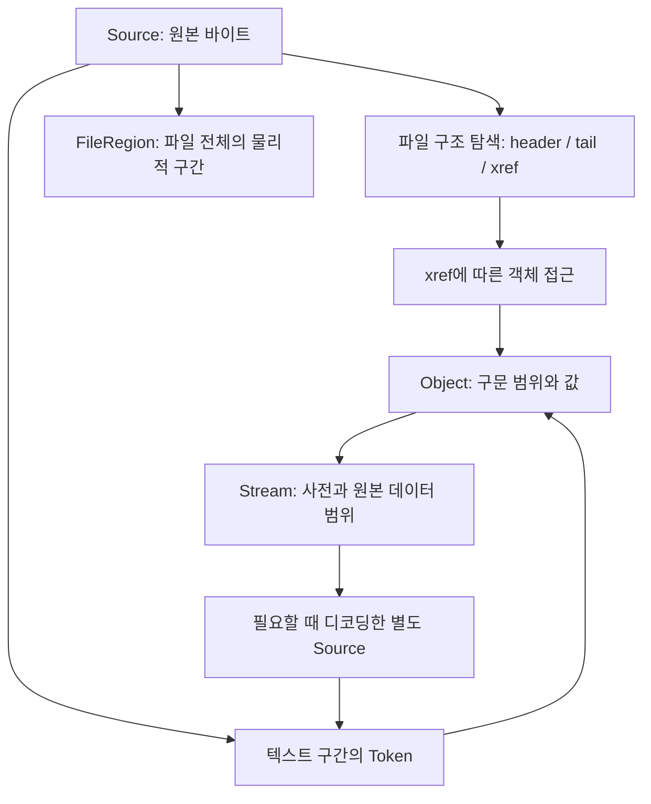
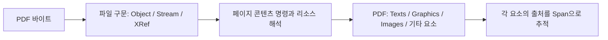

# GoPD: 원본 바이트와 PDF 파일 구조를 위한 타입 설계

작성일: 2026-09-15

상태: 초기 설계와 후속 구현의 배경 문서. 아래 Go 선언은 설계 예시이며, 현재 구현 API와 지원 범위는 루트의 Go 파일 및 README.md를 따른다.

## 1. 목표와 설계 선택

사용자가 선택한 첫 목표는 **원본 바이트와 파일 구조를 정밀하게 분석하는 것**이다. 순수 Go를 전제로 한다.

후속 설명으로 확인한 최종 목표는 **텍스트·그래픽 및 기타 요소의 구조체 슬라이스를 `PDF` 구조체에 모으는 것**이다. 이 문서의 4–10절은 그 결과를 만들기 위한 파일 구문 계층이다. 구문 파싱만으로 페이지의 텍스트·그래픽 분류가 끝나는 것은 아니다. 최종 집계 모델과 중간 해석 계층의 역할은 14절에 추가했다.

분석 결과에서 다음 질문에 답할 수 있어야 한다.

- 이 객체와 각 값은 어느 바이트 범위에서 읽었는가?
- 해석한 값과 원래 표기는 무엇인가? `(A)`와 `<41>`을 구별할 수 있는가?
- 중복된 사전 키, 주석, 공백, 잘못된 구문이 원본에 어떻게 나타나는가?
- 객체는 파일에 직접 저장되었는가, 압축된 object stream 안에 있는가?
- 어떤 xref가 어떤 객체를 가리키며, 이전 xref와 어떤 관계인가?
- 분석기가 확실히 읽은 정보와 복구 과정에서 추정한 정보는 무엇인가?

| 접근 | 장점 | 이번 목표에서의 비용 |
| --- | --- | --- |
| 값 중심 객체 모델 | 사용하기 쉽고 구조가 작다 | 원래 표기, 중복 키, 위치를 별도로 보완해야 한다 |
| 모든 바이트를 토큰 트리로 상주시킴 | 구문 분석과 탐색이 편하다 | 대용량 스트림과 공백까지 객체화하면 메모리 비용이 커진다 |
| **원본 소스 + 바이트 범위 + 해석 객체** | 원본 보존과 의미 탐색을 함께 제공한다 | 소스 수명과 위치 체계를 명확히 관리해야 한다 |

세 번째 방식을 추천한다. 원본 입력을 보존하고 토큰과 객체는 그 입력의 범위를 가리킨다. 토큰 목록은 요청한 범위에 대해 생성하며, 전체 파일의 토큰을 반드시 메모리에 보관하지 않는다.

## 2. 참고 레포에서 가져올 경계

MuPDF는 토큰 분류와 객체 파싱을 구분하고, 객체 값과 xref의 저장 위치 정보를 나누어 관리한다. GoPD도 이 책임 분리를 채택하되 아래 타입은 GoPD의 분석 목적에 맞춘 제안이다. [MuPDF parse.h](https://github.com/ArtifexSoftware/mupdf/blob/master/include/mupdf/pdf/parse.h), [MuPDF object.h](https://github.com/ArtifexSoftware/mupdf/blob/master/include/mupdf/pdf/object.h), [MuPDF xref.h](https://github.com/ArtifexSoftware/mupdf/blob/master/include/mupdf/pdf/xref.h)

PyMuPDF는 MuPDF 위에 구축된 라이브러리다. 저수준 API에서도 객체 정의 조회와 스트림 데이터 조회를 나누고 있다. 이번 단계에서는 이런 API의 역할 분리를 참고한다. [PyMuPDF 저장소](https://github.com/pymupdf/PyMuPDF), [저수준 인터페이스 문서](https://pymupdf.readthedocs.io/en/latest/recipes-low-level-interfaces.html)

규격 확인의 기준은 ISO 32000 계열이다. 구현을 진행할 때 객체·스트림·파일 구조에 해당하는 절을 대조한다. 이 초안은 전체 PDF 규격 준수를 보장하는 명세가 아니다. [PDF Association 규격 아카이브](https://pdfa.org/resource/pdf-specification-archive/)

참고로 Go에도 pdfcpu 같은 PDF 처리 오픈소스가 있다. GoPD의 이번 목표는 원본 바이트와 구문 위치를 직접 탐색할 수 있는 분석 모델로 정한다. [pdfcpu 저장소](https://github.com/pdfcpu/pdfcpu)

## 3. 전체 관계



개발 순서는 바이트 읽기 → lexer → 객체 parser가 자연스럽다. 실제 파일을 여는 흐름에서는 끝부분의 `startxref`로 xref를 찾고, 필요한 객체 위치로 이동하는 경로도 필요하다. 손상 파일의 순차 스캔은 별도 복구 경로다.

## 4. 바이트 소스와 위치

아래 `go` 코드 블록은 순서대로 이어 붙이면 하나의 타입 선언 예시가 된다.

```go
package pdf

import "io"

type SourceID uint32

// Source == 0은 위치 없음. 오프셋은 항상 바이트 단위다.
type Position struct {
	Source SourceID
	Offset int64
}

// [Start, End): Start를 포함하고 End를 제외한다.
type Span struct {
	Source SourceID
	Start  int64
	End    int64
}

type Source struct {
	ID     SourceID
	Reader io.ReaderAt
	Size   int64
	Origin *Derivation // nil이면 원본 파일, 아니면 변환으로 얻은 소스
}

type Derivation struct {
	Input Span
	Steps []Transform
}

type TransformKind uint8

const (
	TransformFilter TransformKind = iota + 1
	TransformDecrypt
)

type Transform struct {
	Kind   TransformKind
	Name   Name
	Params *Object // 없으면 nil; PDF의 명시적 null과 구별
}
```

**불변 조건**

- 유효한 `Span`은 등록된 소스에 대해 `0 <= Start <= End <= Size`를 만족한다. 합산하기 전에 오버플로도 검사한다.
- 파일 위치는 `int64`로 저장한다. 입력은 랜덤 접근이 가능한 `io.ReaderAt`와 크기를 받는다.
- 원본 파일의 SourceID와 디코딩된 스트림의 SourceID는 다르다. 압축 해제 후의 20번째 바이트를 원본 파일의 20번째 바이트로 표시하지 않는다.
- `Derivation.Input`은 변환 전 범위다. 압축된 바이트와 출력 바이트의 일대일 대응을 약속하지 않는다.
- 원본 소스는 분석 도중 바뀌지 않아야 한다. `io.ReaderAt` 자체는 불변성을 강제하지 못하므로 호출자와의 계약으로 명시한다.
- 호출자가 전달한 Reader는 호출자가 닫는다. 원본은 분석 결과를 사용하는 동안 열려 있어야 한다. 디코딩 소스의 버퍼나 임시 파일은 분석기가 소유하고 정리한다.
- 디코딩 소스를 캐시에서 내보내더라도 SourceID를 다른 내용에 재사용하지 않는다. 재생성하거나 명시적인 소스 사용 불가 오류를 반환한다.

## 5. Token: 바이트를 구문 단위로 분류

```go
type TokenKind uint8

const (
	TokenInvalid TokenKind = iota
	TokenEOF
	TokenWhitespace
	TokenComment
	TokenInteger
	TokenReal
	TokenName
	TokenLiteralString
	TokenHexString
	TokenArrayOpen
	TokenArrayClose
	TokenDictOpen
	TokenDictClose
	TokenKeyword
)

type Token struct {
	Kind TokenKind
	Span Span
}
```

- `Token`에는 `Raw []byte`를 중복 저장하지 않는다. 원문은 `Span`으로 읽는다.
- `true`, `false`, `null`, `R`, `obj`, `endobj`, `stream`, `endstream`, `xref`, `trailer`, `startxref`는 lexer에서 `TokenKeyword`로 내보내고 parser가 문맥에 따라 해석한다.
- `%PDF-1.7`과 `%%EOF`는 lexer 수준에서는 주석이다. 파일 구조 탐색기가 위치와 문맥을 확인한 뒤 header/EOF로 인식한다. 문자열이나 스트림 안에서 같은 바이트가 나왔다고 파일 경계가 되지는 않는다.
- `(a(b)c)`는 괄호 중첩을 고려하는 문자열 하나다. `\(`, `\)`, `\\`, 줄 이어쓰기와 8진수 이스케이프를 처리한다.
- `<`와 `<<`, `>`와 `>>`를 구분한다. `/A#20B` 같은 이름의 escape도 해석 단계에서 처리한다.
- PDF의 공백은 바이트 집합 `00, 09, 0A, 0C, 0D, 20`이다. 일반 Unicode 공백 분류 함수를 사용하지 않는다. 예상하지 못한 구분자는 `TokenInvalid`로 위치를 남긴다.
- lexer는 **경계가 정해진 텍스트 구간**을 읽는다. parser가 `stream`을 인식하면 데이터 경계를 판정한 뒤 그 구간을 건너뛴다. 바이너리 payload를 일반 PDF 토큰으로 해석하지 않는다.
- lexer의 입력 끝을 나타내는 `TokenEOF`는 길이 0인 토큰이다. 파일의 `%%EOF` 마커와 다르다.
- 주석과 공백도 요청 시 모두 반환한다. 미해석 바이트를 보존하는 최종 근거는 원본 Source다.

## 6. Object: 해석한 값과 원래 구문 범위

```go
type Value interface {
	pdfValue()
}

type Object struct {
	Span  Span
	Value Value
}

type Null struct{}
type Boolean bool

// PDF 숫자 문법을 검증한 십진 표기. 자동으로 float64로 바꾸지 않는다.
type Integer string
type Real string

// '/'를 제외하고 #xx escape를 해제한 바이트열. UTF-8을 보장하지 않는다.
type Name string

type StringForm uint8

const (
	StringLiteral StringForm = iota + 1
	StringHex
)

type PDFString struct {
	Form  StringForm
	Bytes []byte // 구문 escape/hex 해제 후, 암호 해제 및 문자 디코딩 전
}

type Array struct {
	Items []Object
}

type DictionaryEntry struct {
	Key     Name
	KeySpan Span
	Value   Object
}

type Dictionary struct {
	Entries []DictionaryEntry
}

type ObjectID struct {
	Number     uint32
	Generation uint16
}

type Reference struct {
	ID ObjectID
}

// 손상된 구문을 표현하는 분석기 전용 값. PDF의 null과 구별한다.
type InvalidValue struct {
	Reason string
}

func (Null) pdfValue()         {}
func (Boolean) pdfValue()      {}
func (Integer) pdfValue()      {}
func (Real) pdfValue()         {}
func (Name) pdfValue()         {}
func (PDFString) pdfValue()    {}
func (Array) pdfValue()        {}
func (Dictionary) pdfValue()   {}
func (Reference) pdfValue()    {}
func (InvalidValue) pdfValue() {}
```

### 이 모양을 선택한 이유

1. **위치는 바깥 `Object`에 둔다.** 배열 원소, 사전 값, 참조 등 모든 객체가 동일한 방식으로 자신의 구문 범위를 가진다. 사전 키에도 별도 범위가 있다.
2. **숫자를 자동으로 부동소수점으로 바꾸지 않는다.** `+001`, `1.000`, 매우 큰 정수를 그대로 담는다. 후속 API `Int64() (int64, error)`, `Float64() (float64, error)`는 요청 시 변환하고 범위를 검사한다. 위치나 길이로 사용할 때는 허용 범위와 음수 여부를 별도 검증한다.
3. **PDF 문자열은 바이트다.** `(A)`, `(\101)`, `<41>`은 같은 바이트 값이어도 원래 구문은 다르다. `PDFString.Bytes`는 값 비교에, `Object.Span`은 원문 비교에 쓴다. 텍스트 인코딩 및 폰트별 문자 해석은 후속 계층이다.
4. **사전은 순서 있는 항목 목록이다.** PDF의 정상 사전은 키가 유일하며 순서에 의미를 부여하지 않는다. 분석기는 실제 저장 순서와 잘못된 중복 키를 보존한다. `GetAll(key)`를 기본 탐색으로 제공하고, 단일 조회는 중복 여부를 오류로 알린다. `map[Name]Object`로 먼저 축약하지 않는다.
5. **참조를 값으로 남긴다.** `12 0 R`은 정수 두 개가 아닌 참조 한 개다. parser가 자동으로 대상 객체를 펼치지 않는다. 따라서 정상적인 순환 참조도 원형을 유지한다.
6. **오류와 null을 구분한다.** 실패한 값은 `InvalidValue`와 진단으로 남긴다. 잘못된 사전 키처럼 항목으로 표현하기 어려운 경우 해당 구문 범위를 `InvalidValue`로 보존한다. 모든 손상 구문을 정상 Dictionary로 강제하지 않는다.

`Value`는 PDF 값의 제한된 집합을 표현하는 인터페이스다. `nil` Value 및 typed nil은 정상 파싱 결과로 내보내지 않는다. 위 선언은 구조를 검토하기 쉽게 공개 필드를 사용했다. 실제 읽기 API는 getter 및 복사 정책으로 slice 변경을 제한하고, 결과를 읽기 전용으로 취급한다.

## 7. Stream: 사전과 바이너리 범위

```go
type StreamBoundary uint8

const (
	StreamUnresolved StreamBoundary = iota
	StreamFromLength
	StreamRecovered
)

type Stream struct {
	Dictionary     Dictionary
	DictionarySpan Span
	StartKeyword   Span
	DataStart      Position
	Encoded        *Span // 경계를 모르면 nil
	EndKeyword     *Span // 확인하지 못했으면 nil
	Boundary       StreamBoundary
}

func (Stream) pdfValue() {}
```

- `Object.Span`은 사전부터 확인한 `endstream`까지의 구문 범위다. 손상되어 끝을 확인하지 못했다면 실제 소비한 범위와 진단을 남긴다.
- `Encoded`는 파일에 저장된 데이터 바이트만 가리킨다. `stream` 뒤의 구분 개행과 데이터 바깥의 `endstream`은 포함하지 않는다. 암호화된 입력에서는 암호문이다. MuPDF API의 일부 `raw` 명칭이 암호 해제 후 데이터를 의미하므로 GoPD에서는 이 의미를 명확히 구분한다. [MuPDF 스트림 API 설명](https://github.com/ArtifexSoftware/mupdf/blob/master/include/mupdf/pdf/xref.h)
- `/Length`는 원래 Dictionary의 Object로 보관한다. 정수일 수도 있고 `20 0 R` 같은 간접 참조일 수도 있다. 이를 해석하기 전에 임의의 길이로 단정하지 않는다.
- `/Length`를 확인한 뒤 입력 범위와 종료 구문을 검증해야 `StreamFromLength`로 표시한다. 길이가 0인 스트림은 유효한 빈 Span으로 표현하며 nil과 구별한다.
- `endstream` 검색만으로 payload의 끝을 결정하지 않는다. 손상 파일에서 후보를 검색할 때도 뒤따르는 구문을 검증하고 `StreamRecovered`와 진단을 남긴다. 경계가 불확실하면 `StreamUnresolved`로 보존한다.
- 스트림은 간접 객체의 본문에만 허용한다. 배열이나 사전 안에는 Stream 값 자체를 넣지 못하도록 parser가 검증한다. 그 안에서는 스트림 객체에 대한 Reference를 쓴다.
- `/Filter`와 `/DecodeParms`의 원래 모양을 Dictionary에 보존한다. 필터 배열은 순서대로 적용하고, 파라미터와 null의 대응을 유지한다. 디코딩 결과는 원본을 덮어쓰지 않고 별도 Source로 등록한다.
- 알 수 없는 필터, 미지원 암호화, 외부 스트림(`/F`)은 원문을 유지하고 디코딩 요청에 미지원 결과를 반환한다. 외부 파일을 자동으로 열지 않는다.

## 8. 간접 객체: 식별자와 실제 저장 형태

```go
type ObjectOrigin interface {
	pdfObjectOrigin()
}

type FileObjectOrigin struct {
	Whole  Span  // n g obj부터 확인한 endobj까지
	Header Span  // n g obj
	EndObj *Span // 손상으로 확인하지 못하면 nil
}

type ObjectStreamOrigin struct {
	Container     ObjectID
	ContainerSpan Span   // 원본 파일의 정확한 컨테이너 발생 위치
	Index         uint32 // object stream 내부 순번, generation이 아님
	HeaderPair    Span   // 디코딩 소스 안의 객체 번호/상대 오프셋 쌍
}

type IndirectObject struct {
	ID     ObjectID
	Body   Object
	Origin ObjectOrigin
}

func (FileObjectOrigin) pdfObjectOrigin()   {}
func (ObjectStreamOrigin) pdfObjectOrigin() {}
```

- 같은 `ObjectID`가 증분 저장으로 여러 번 나타날 수 있다. ID만으로 물리적 객체의 유일성을 판단하지 않는다. 파일 소스의 발생 위치도 보존한다.
- 압축 객체의 `Body.Span`은 디코딩 Source의 범위다. 원본 위치는 `ContainerSpan`과 소스의 `Derivation`을 따라간다.
- object stream 안의 객체에는 개별 `obj`/`endobj` 래퍼가 없다. 이를 가짜 파일 범위로 생성하지 않는다.
- object stream의 `/N`, `/First`, 헤더의 상대 오프셋을 검증한다. 포함 객체의 generation은 0이며, 스트림 객체 자체는 object stream에 들어갈 수 없다.

## 9. XRef: 파일 오프셋과 압축 객체 위치를 구분

```go
type XRefEntry interface {
	pdfXRefEntry()
}

type FreeEntry struct {
	NextFree   uint32
	Generation uint16
}

type InUseEntry struct {
	Offset     int64
	Generation uint16
}

type CompressedEntry struct {
	StreamNumber uint32
	Index        uint32
}

type UnknownXRefEntry struct {
	Type uint64 // 미지원 엔트리 종류; 나머지 원문은 XRefRecord.Span에 보존
}

type XRefRecord struct {
	Number uint32
	Span   Span // xref stream이면 디코딩 Source 안의 범위
	Entry  XRefEntry
}

type XRefRange struct {
	First   uint32
	Count   uint32
	Header  *Span // 텍스트 xref subsection 헤더. xref stream이면 nil
	Records []XRefRecord
}

type XRefForm uint8

const (
	XRefTable XRefForm = iota + 1
	XRefStream
)

type SectionID uint32

type XRefSection struct {
	ID         SectionID
	Form       XRefForm
	Offset     int64 // 원본 파일에서 xref 또는 xref stream 객체의 시작
	Span       Span
	Ranges     []XRefRange
	Trailer    Object // table trailer 또는 xref stream의 사전
	Prev       *int64 // 검증한 /Prev. 원래 값은 Trailer에 남는다.
	XRefStm    *int64 // 검증한 /XRefStm. hybrid 참조 관계를 보존한다.
	StreamID   *ObjectID
}

func (FreeEntry) pdfXRefEntry()         {}
func (InUseEntry) pdfXRefEntry()        {}
func (CompressedEntry) pdfXRefEntry()   {}
func (UnknownXRefEntry) pdfXRefEntry()   {}
```

핵심은 `Offset`과 `StreamNumber`, `Generation`과 `Index`를 다른 필드로 표현하는 것이다. 값이 차지하는 저장 필드가 비슷하다는 이유로 하나의 정수 필드를 여러 의미로 재사용하지 않는다.

일반 xref table과 xref stream은 엔트리 모델을 공유하지만 원래 형식은 보존한다. xref stream의 `/W`, `/Index`, `/Size`는 사전의 원본 값으로 남긴다. 없는 `/Index`의 기본 범위와 `/W`의 0 폭 필드 기본값은 파생 해석으로만 적용한다.

**원본 섹션과 현재 유효 인덱스는 별도다.**

- XRefSection 목록은 덮어쓰지 않는다. `/Prev` 및 `/XRefStm` 링크로 관계를 탐색한다.
- `/XRefStm`은 같은 hybrid 구조의 보충 xref stream이며, 별도의 사용자 저장 이력으로 세지 않는다. 충돌 시 해당 stream 엔트리를 우선하는 규칙은 유효 인덱스를 계산할 때 적용한다.
- 최신 체인에서 객체 번호별 첫 유효 엔트리를 선택하며, free 엔트리도 이전 객체를 가리는 엔트리다. 삭제된 객체를 과거 항목으로 되살리지 않는다.
- 참조 해석 시 generation까지 검사한다. 캐시는 파일 발생 위치 또는 선택한 xref 문맥을 포함하여 이전 버전과 섞이지 않게 한다.
- 순환 `/Prev`, 잘못된 오프셋, 중복 레코드는 진단으로 남긴다. 손상된 항목을 조용히 병합하지 않는다.
- xref 섹션 개수를 저장 횟수로 단정하지 않는다. linearized PDF의 구조 및 hybrid 관계를 분류한 후에야 별도의 revision 뷰를 만들 수 있다.
- uint32/uint16은 저장 타입이다. parser는 변환 전 규격과 구현 한계를 검사한다. 범위 밖 입력은 원문과 진단으로 남기고 잘린 정수로 저장하지 않는다.

## 10. 파일 전체 구조와 진단

```go
type Version struct {
	Major uint8
	Minor uint8
}

type Header struct {
	Span    Span
	Version Version // 파일 헤더의 버전. Catalog의 /Version과 별도다.
}

type FileTail struct {
	StartXRef Span
	Offset    int64
	OffsetRaw Span
	EOFMarker Span
}

type RegionKind uint8

const (
	RegionUnknown RegionKind = iota
	RegionHeader
	RegionTrivia
	RegionIndirectObject
	RegionXRef
	RegionTrailer
	RegionFileTail
)

type FileRegion struct {
	Kind RegionKind
	Span Span
}

type Severity uint8

const (
	SeverityInfo Severity = iota + 1
	SeverityWarning
	SeverityError
)

type Diagnostic struct {
	Severity Severity
	Code     string
	Message  string
	Span     Span
	Related  []Span
}

type Limits struct {
	MaxDepth        int
	MaxTokenBytes   int64
	MaxObjects      int
	MaxXRefSections int
	MaxDecodedBytes int64 // 분석 세션 전체 디코딩 출력 예산
}

type Structure struct {
	File        SourceID
	Header      *Header
	Tails       []FileTail
	XRefs       []XRefSection
	Objects     []IndirectObject // 지금까지 파싱한 발생 목록
	Regions     []FileRegion
	Diagnostics []Diagnostic
}
```

- `Structure`는 현재 분석 결과의 읽기 전용 스냅샷이다. Source 관리, 캐시, I/O는 후속 `Analyzer`가 담당한다. `Objects`는 전체 객체를 미리 디코딩해야 한다는 뜻이 아니다.
- `Regions`는 원본 파일을 순서대로 나누는 물리적 구간이다. 범위는 서로 겹치지 않으며 전체 `[0, Size)`를 덮는다. 분석하지 않았거나 판별하지 못한 구간은 `RegionUnknown`으로 남는다.
- 중첩된 구문은 Object/Stream 등의 Span으로 표현한다. 예를 들어 xref stream의 물리적 구간은 간접 객체 한 번으로만 기록하고, XRefSection은 그 구간을 별도 뷰로 참조한다.
- 주석, 공백, header 앞의 데이터, 마지막 EOF 뒤의 데이터도 원본 및 Regions에 남는다. EOF 뒤 데이터가 추가 저장 구조인지 잔여 데이터인지는 후속 해석으로 표시한다.
- `Tails`에는 문맥을 검증한 `startxref`/`%%EOF` 쌍을 저장한다. 불완전한 후보는 원래 Region과 진단으로 남긴다.
- 진단 코드는 `invalid-stream-length`, `duplicate-dictionary-key`, `xref-cycle`, `unsupported-filter`, `resource-limit`처럼 안정된 문자열로 정의한다. 복구 추정은 원래 값과 함께 제공하며 원본을 수정하지 않는다.
- 구문 오류는 가능한 범위에서 부분 결과와 Diagnostic을 반환한다. I/O 실패, 취소, 자원 한계 도달은 호출의 error로 반환하면서 이미 확보한 결과와 위치도 제공한다.
- 정상적인 객체 그래프의 순환 참조를 곧바로 손상으로 판정하지 않는다. 방문 집합과 깊이 제한은 자동 추적 및 잘못된 참조 체인이 무한히 반복되는 것을 막는 데 쓴다.
- Limits의 0 값은 문서화된 기본값으로 정규화한다. 음수는 옵션 오류다. 제한에 도달하면 조용히 자르지 않고 어떤 분석이 미완료인지 진단한다.

## 11. 실제 입력과 타입 연결 예시

```pdf
12 0 obj
<< /Length 13 0 R /Filter /FlateDecode /Label (A\101) >>
stream
...binary data...
endstream
endobj
```

이 예시의 바이너리와 길이는 설명을 위한 자리 표시이며 실제 PDF fixture가 아니다.

- `IndirectObject.ID`: `{Number: 12, Generation: 0}`.
- `IndirectObject.Origin`: `FileObjectOrigin`.
- `IndirectObject.Body.Value`: `Stream`.
- `Stream.Dictionary.Entries`의 `Length` 값: `Reference{ID: ObjectID{Number: 13, Generation: 0}}`.
- `Filter` 값: `Name("FlateDecode")`.
- `Label` 값: `PDFString{Form: StringLiteral, Bytes: []byte{'A', 'A'}}`.
- `Label`의 Object.Span을 읽으면 `(A\101)` 원문을 얻는다.
- 길이 객체를 아직 읽지 않았다면 `Stream.Encoded == nil`, `Boundary == StreamUnresolved`다.

`12 0 obj`의 **정의**와 `12 0 R`의 **참조**를 서로 다른 타입으로 표현하는 것이 중요하다.

## 12. 후속 구현 단위와 검증 기준

권장 파일 구분은 같은 `pdf` 패키지 안의 `source.go`, `token.go`, `object.go`, `stream.go`, `xref.go`, `structure.go`, `diagnostic.go`다. 초기부터 별도 패키지로 나누어 순환 의존성을 만들 필요는 없다. Lexer/parser의 버퍼와 lookahead는 비공개 구현 세부 사항으로 둔다.

첫 구현 범위는 Source/Span, lexer, 기본 객체 parser다. Stream과 xref 타입은 경계를 잡아 두고 순서대로 구현한다. 그 다음에는 14절의 최종 모델을 만들기 위해 콘텐츠 명령 해석과 폰트 기반 텍스트 해석을 진행한다. 픽셀 렌더링, 편집 및 저장 API는 별도 설계다.

| 단계 | 실제 구현에서 확인할 동작 |
| --- | --- |
| 소스·토큰 | 모든 공백 바이트, CR/LF/CRLF, 주석, 중첩 괄호, escape, 이름 #xx, 홀수 hex 문자열, 잘못된 구분자 |
| 객체 | 배열·사전 중첩, `12 0 R`와 `[12 0]` 구분, 숫자 정밀도, 중복 키 보존, null과 오류 구별 |
| 스트림 | 직접/간접 Length, 0 길이, payload 안의 endstream, 잘못된 길이와 복구 표시 |
| xref | 일반 table, xref stream, 압축 객체, hybrid, 증분 갱신, free 항목 우선, generation 불일치, Prev 순환 |
| 원본 추적 | Span의 정확한 바이트, 디코딩 소스와 원본 위치 구분, Regions의 비중첩·전체 범위 보존 |
| 실패 처리 | EOF 중단, 오버플로, 깊이 제한, 디코딩 예산 초과, 미지원 필터·암호화, I/O 오류 |

파서 fuzzing에서는 무한 반복과 panic 부재, 모든 범위의 유효성, 입력 바이트를 빠뜨리지 않는 구간 보존을 확인한다. 토큰을 다시 직렬화해서 원본과 같아지는 것과 원본 범위를 그대로 읽는 것은 다른 보장이다. 이번 설계는 후자를 제공하며, 수정 후의 바이트 단위 재저장까지 약속하지 않는다.

## 13. 이번 산출물의 범위

이 문서는 사용자 요청에 대한 타입 설계안으로 시작했다. 이후 구현 요청에 따라 Go 모듈, lexer/parser, xref/스트림 reader, 초기 페이지 콘텐츠 해석기와 CLI를 추가했다. 파일 저장 기능은 구현하지 않았다. 실제 지원 범위와 제한은 [README](../../../README.md)에 기록했다.

검증: 문서의 Go 코드 블록 7개를 임시 파일 하나로 합쳐 `gofmt` 및 `go test <임시 design.go 경로>`를 실행했고 종료 코드 0을 확인했다. 실행 결과는 `[no test files]`이며 선언의 문법과 타입 관계에 대한 컴파일 확인이다. 실제 PDF를 처리하는 동작 테스트는 아니다. 검증용 임시 파일은 제거했다.

## 14. 최종 목표 보완: PDF 안에 텍스트·그래픽 요소를 집계

### 파일 구문과 페이지 내용은 다른 단계다

앞에서 설계한 `Dictionary`, `PDFString`, `Stream`은 PDF 파일을 구성하는 구문 타입이다. 여기서 `PDFString`이 나왔다고 그것이 곧 페이지에 표시할 텍스트인 것은 아니다. 메타데이터 등의 문자열일 수도 있다.

페이지의 `/Contents` 스트림에는 텍스트, 경로, 이미지 호출, 좌표 변환 등 여러 명령이 섞일 수 있다. 페이지 트리와 `/Resources`를 따라가면서 이 명령을 순서대로 해석해야 최종 요소를 만든다. 여러 Contents 스트림도 연결된 명령 흐름으로 해석한다. [PyMuPDF의 Page Contents 설명](https://pymupdf.readthedocs.io/en/latest/recipes-low-level-interfaces.html#how-to-handle-page-contents)



명령 해석기는 예를 들어 텍스트 표시 명령 `Tj`/`TJ`, 경로 명령과 채우기·선 그리기 명령, XObject 호출을 구별한다. `Do`가 가리키는 대상은 리소스를 조회해야 Image인지 Form인지 알 수 있다. Form에는 텍스트·그래픽·이미지 명령이 다시 들어갈 수 있으므로 호출 문맥을 유지한 채 해석한다.

### 추천하는 집계 관계

| 소유자 | 필드 | 의미 |
| --- | --- | --- |
| PDF | `Pages []Page` | 페이지별 크기, 회전, 순서와 콘텐츠 접근 |
| PDF | `Texts []Text` | 문서 전체의 텍스트 표시 요소 |
| PDF | `Graphics []Graphic` | 벡터 경로, 채우기, 선, shading 등의 그래픽 요소 |
| PDF | `Images []Image` | 페이지에 배치된 이미지의 각 발생 |
| PDF | `Fonts []Font` | 텍스트 해석에 사용하는 폰트 리소스 |
| PDF | `Annotations []Annotation` | 페이지 주석·링크 등의 구조 |
| PDF | `Structure *Structure` | 기존 저수준 파일 분석 결과와 연결 |
| Page | `Items []ElementRef` | 요소 종류와 해당 PDF 슬라이스의 인덱스를 그리기 순서대로 기록 |
| Page | `Operations` | 상태 변경까지 포함하는 콘텐츠 명령 흐름 |

Go에서 위 `[]T`는 크기가 고정된 배열이 아니라 slice다. 문서마다 요소 수가 달라지는 이 용도에 맞는다.

분류별 배열만 두는 방식은 조회하기 쉽지만 종류 사이의 순서를 잃는다. 페이지별 배열만 두면 문서 전체 조회 시 페이지를 순회해야 한다. 사용자가 원하는 **PDF의 분류별 슬라이스 + Page의 순서 참조 목록**을 추천한다. 같은 요소 데이터를 두 군데 복제하지 않고 Page에서는 인덱스로 참조한다.

예를 들어 한 페이지의 `Items`가 `Graphic(0), Text(0), Image(0), Text(1)`이면 각각 `PDF.Graphics[0]`, `PDF.Texts[0]`, `PDF.Images[0]`, `PDF.Texts[1]`을 이 순서로 처리한다. 인덱스는 스냅샷 안에서 유효하며 읽기 전용 API로 제공한다. 추후 편집을 지원할 때는 별도의 안정된 ID와 변경 규칙을 정한다.

페이지 요소의 실행 순서는 겹침 분석에 필요하다. PyMuPDF도 bbox 목록의 순서 및 텍스트·그리기 결과의 `seqno`로 이런 관계를 연결한다. [PyMuPDF get_bboxlog](https://pymupdf.readthedocs.io/en/latest/functions.html#Page.get_bboxlog)

### 각 요소에서 보존할 정보

- **공통:** 페이지 인덱스, 좌표 범위, 좌표계, 변환 행렬, 그리기 상태, 원본 명령 위치, Form 호출 경로. 한 요소가 여러 명령이나 스트림 조각에서 만들어질 수 있으므로 출처는 하나의 Span으로 제한하지 않는다.
- **Text:** 원본 문자 코드, 해석한 Unicode와 해석 성공 여부, 폰트, 크기, glyph별 위치 및 변위, 텍스트 행렬과 표시 모드. 기본 단위는 단어·문단이 아닌 텍스트 표시 구간으로 두고 읽기 순서와 문단 묶기는 파생 분석으로 제공한다.
- **Graphic:** 벡터 경로 또는 shading 등 구체 종류, 경로 세그먼트, 채우기 규칙, 선 스타일, 색공간·색상, clipping, 투명도 및 합성 상태. 원·사각형·차트 같은 사용자 의미는 원래 명령에서 항상 구분되는 것이 아니므로 우선 경로로 보존한다.
- **Image:** 이미지 리소스와 배치 발생을 구분한다. 같은 이미지가 3번 그려지면 배치 요소는 3개이며 바이너리 리소스는 공유할 수 있다. inline image도 표현해야 한다.
- **기타:** 주석, 링크, 폼 필드, 첨부 파일 등은 별도 구조다. 주석의 외관을 분석할 때는 본문과 구별된 콘텐츠 문맥으로 처리한다.

`Items`는 종류 사이의 요소 순서를 보존하지만, 이것만으로 완전한 렌더링을 재현하는 것은 아니다. 상태 저장/복원, clipping, transparency group, optional content, Form 호출 등을 별도로 보존해야 한다. 따라서 콘텐츠 명령 흐름과 상태·스코프 모델을 중간 계층에 둔다. MuPDF의 device 인터페이스에도 텍스트·경로·이미지와 함께 clip/group 등의 처리가 나뉘어 있다. [MuPDF device.h](https://github.com/ArtifexSoftware/mupdf/blob/master/include/mupdf/fitz/device.h)

폰트나 문자 매핑 정보가 부족하면 텍스트 표시 명령임은 알아도 정확한 Unicode를 복원하지 못할 수 있다. 이 경우 원래 문자 코드와 위치를 유지한다. 이미지 안에 찍힌 글자나 윤곽선으로 변환된 글자를 텍스트로 인식하는 것은 OCR 등의 별도 분석이다.

이 보완은 최상위 데이터 소유 관계와 필요한 중간 계층을 정한다. 후속 초기 구현에서 Text/Graphic 및 그리기 상태의 필드를 `model.go`로 구체화했다. shading, 완전한 투명도 합성 등 이 절에 제시한 모든 기능이 구현된 것은 아니다. 실제 지원 범위와 오류·진단 정책은 README.md를 따른다.
